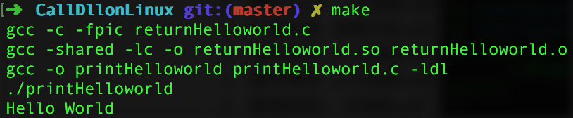
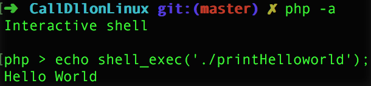

# Call DLL on Linux
The project shows how to call DLL on Linux. 

The code is based on that from the article [*Writing DLLs for Linux apps*](http://www.ibm.com/developerworks/library/l-dll/).

## DLL on Linux
The DLL on Linux is `.so` ([Shared Object](http://stackoverflow.com/a/9810368/5920930)) instead of `.dll` (Dynamic-link library) which you often see on Windows.

## How files work together
1. `printHelloworld` call function `returnHelloworld()` in `returnHelloworld.so`
2. `returnHelloworld.so` return string `"Hello World"` to the `main()` function in `printHelloworld`
3. `printHelloworld` prints the string `"Hello World"` to **console**

`make` and you will see:

## How it works with PHP
1. With bash, you can start PHP with command `php -a` 
2. then call the dynamic-link file `printHelloworld` 
3. `echo` the return value of `printHelloworld` on screen

